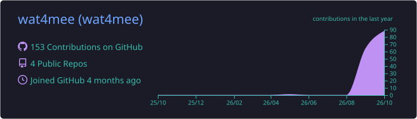
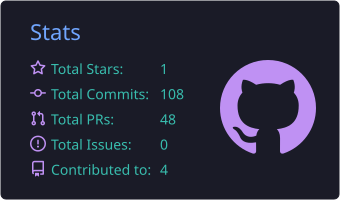
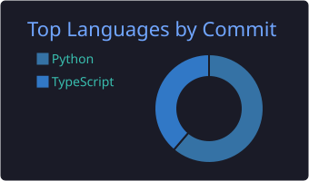
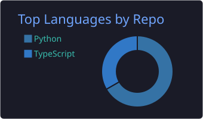
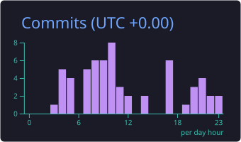

<!-- ===================== HEADER ===================== -->
<p align="center">
  
</p>

<p align="center">
  <a href="https://git.io/typing-svg">
    
  </a>
</p>

<p align="center">
  
  
  
</p>


<!-- ===================== ABOUT ===================== -->
##  About me

<table>
<tr>
<td width="55%">

```c
#include "me.h"

struct s_dev wat4mee = {
    .location  = "Tashkent, UZ",
    .uni       = "INHA University — SOCIE (CIE)",
    .school    = "School 21 (peer-to-peer)",
    .languages = {"Uzbek", "Russian", "English"},
    .focus     = {
        "Penetration testing",
        "ESP32 & LoRa hardware",
        "Web development (Flask)",
        "Local / offline AI",
    },
    .goal      = "OSCP",
};
```

</td>
<td width="45%" align="center">
  
</td>
</tr>
</table>

- 🛡️ Learning offensive security — WiFi pentesting, CTFs, on the road to **OSCP**
- 📡 Tinkering with **ESP32** and **LoRa** boards
- 🌐 Building web apps with **Flask + PostgreSQL**
- 🤖 Exploring AI that runs **locally and offline**
- 💬 Ask me about: C, Python, Linux, hacking hardware


<!-- ===================== STACK ===================== -->
## 🧰 Tech stack

<p align="center">
  
  <br/>
  
</p>

<!-- ===================== PROJECTS ===================== -->
## 🚀 Featured projects

| Project | What it is | Stack |
|---|---|---|
| 🏺 **[EtnoArt](https://etnoart.uz)** | Marketplace for Uzbek artisans — Google OAuth, reviews API, live currency rates, dark mode | Flask · Postgres · DigitalOcean |
| 📚 **eClass Companion** | Auto-syncs INHA eClass (Moodle) materials, tracks deadlines, AI summaries | Python · AI |
| 👁️ **DaemonEye** | WIUT Hackathon 2026, CV track — traffic event detection | Python · Computer Vision |


<!-- ===================== STATS ===================== -->
## 📊 GitHub stats

<!-- These cards are generated by .github/workflows/stats.yml inside this repo -->
<p align="center">
  
</p>

<p align="center">
  
  
</p>

<p align="center">
  
  
</p>

<p align="center">
  
</p>

<!-- ===================== SNAKE ===================== -->
## 🐍 Contribution snake

<p align="center">
  <picture>
    <source media="(prefers-color-scheme: dark)" srcset="https://raw.githubusercontent.com/wat4mee/wat4mee/output/github-contribution-grid-snake-dark.svg">
    
  </picture>
</p>

<!-- ===================== FOOTER ===================== -->
<p align="center">
  
</p>
